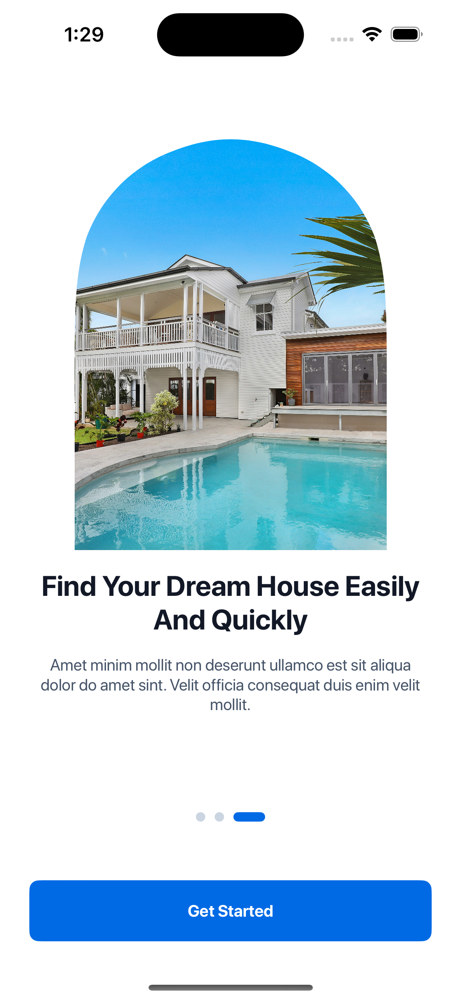
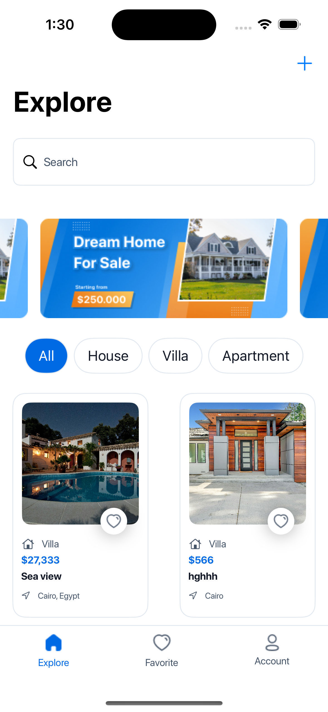
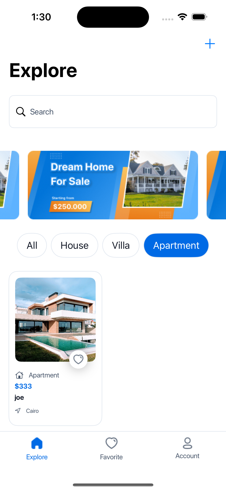
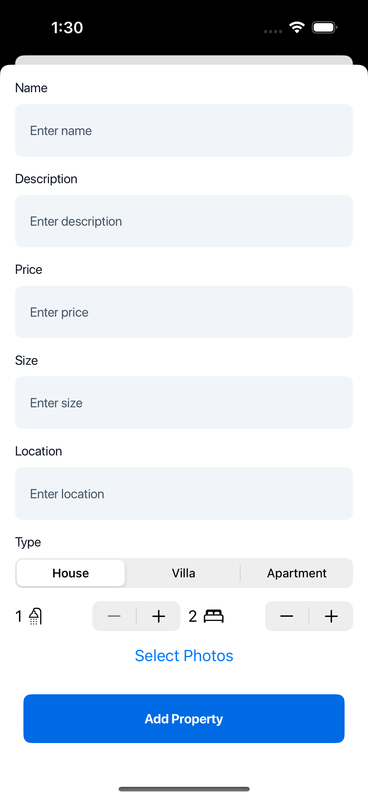
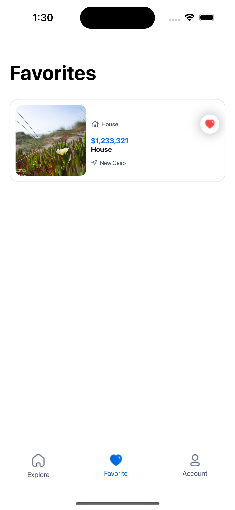
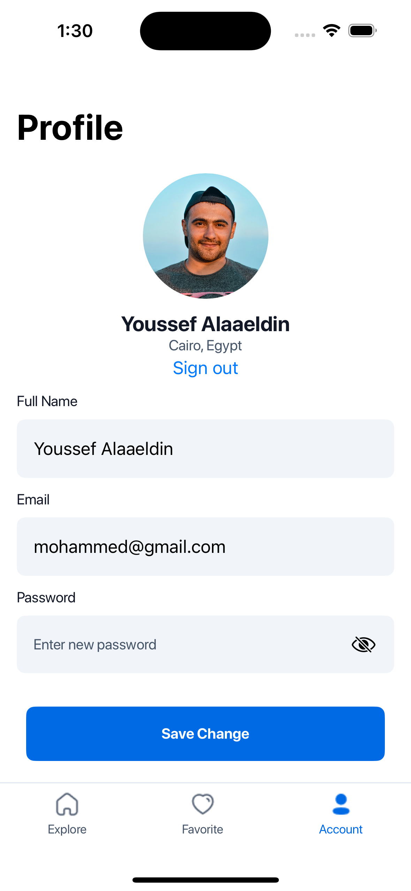
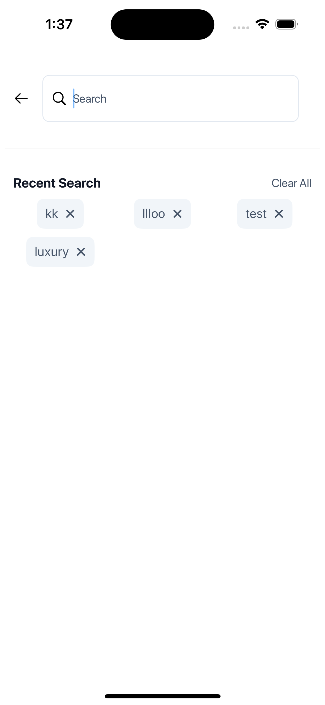
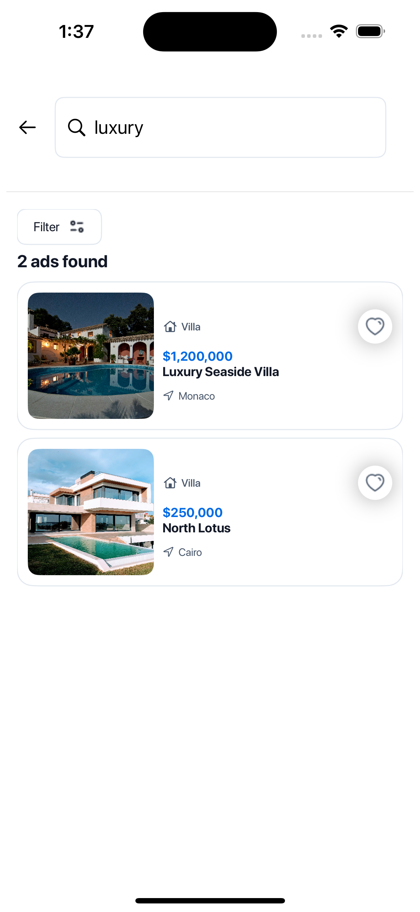
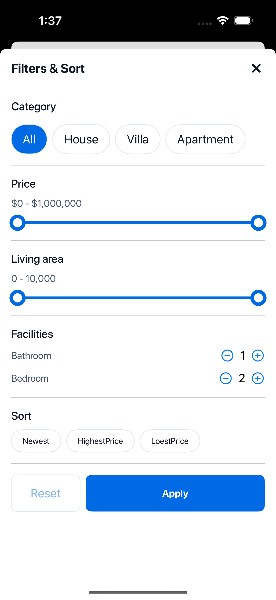

# Aman

Aman is a real estate application built using SwiftUI. It provides users with the ability to explore various properties, add their own properties to be showcased, manage their profiles, and search or filter properties based on different criteria. Authentication and data management are handled securely using Firebase, offering a smooth and reliable experience.

## Features

- **User Authentication**: Secure sign up, sign in, and sign out functionalities using Firebase.
- **Property Exploration**: Browse through a wide range of properties listed on the platform.
- **Add Properties**: Users can add new properties to be visible to other users. Images uploaded by users when adding properties are automatically compressed to optimize storage and performance.
- **Image Caching**: Property images are cached using SDWebImage to provide a smoother and faster user experience.
- **Favorite Properties**: Users can add properties to their favorites and view them later.
- **Search and Filter**: Search properties by name and filter the results by price, area, number of bathrooms, and number of bedrooms.
- **Profile Management**: Update profile information like username, email, and password.
- **Data Validation**: Input validation is achieved using Combine for efficient error handling and data consistency.

## Screenshots
|  |  |  |
| --- | --- | --- |
|  |  |  |
|  |  |  |

## Technologies Used

### SwiftUI
SwiftUI is the primary framework used to build the Aman application. It provides a declarative approach to design the UI, allowing developers to create complex and responsive layouts with less code.

### Firebase
Firebase is integrated into the Aman app for managing user authentication and storing property data. It provides a secure way to handle user information, including sign up, sign in, and profile management, as well as storing property data in Firestore.

### Combine
Combine is used for data binding and validation within the app. It enables efficient state management and reactive programming, which simplifies data flow and error handling.

### SDWebImage
SDWebImage is used for image downloading and caching in the Aman app. It helps provide a seamless and fast user experience by caching property images and loading them efficiently.

### Image Compression
Images uploaded by users when adding properties are automatically compressed to optimize storage space and improve loading times. This feature helps in maintaining the app's performance and reducing data usage.

## Installation

1. Clone the repository:
    ```sh
    git clone https://github.com/YOUR_USERNAME/aman-real-estate-app.git
    ```
2. Navigate to the project directory:
    ```sh
    cd aman-real-estate-app
    ```
3. Open the project in Xcode:
    ```sh
    open Aman.xcodeproj
    ```
4. Install dependencies using CocoaPods (if applicable):
    ```sh
    pod install
    ```
5. Open the `.xcworkspace` file in Xcode:
    ```sh
    open Aman.xcworkspace
    ```

## Usage

1. Set up Firebase in your project by following the [official Firebase documentation](https://firebase.google.com/docs/ios/setup).
2. Make sure Firestore and Authentication are enabled in your Firebase console.
3. Install SDWebImage by adding it to your Podfile and running `pod install`.
4. Build and run the application on your device or simulator.
5. Sign up or sign in using your Firebase credentials.
6. Start exploring, adding properties (with compressed images), managing favorites, and updating your profile.

## Contributing

Contributions are welcome! Please open an issue or submit a pull request with your changes. Make sure to follow the existing code style and include relevant tests for new features.

## License

This project is licensed under the MIT License. See the [LICENSE](LICENSE) file for more details.

## Acknowledgements

- [Firebase](https://firebase.google.com/)
- [SwiftUI](https://developer.apple.com/xcode/swiftui/)
- [Combine](https://developer.apple.com/documentation/combine)
- [SDWebImage](https://github.com/SDWebImage/SDWebImage)

---

Replace `YOUR_USERNAME` with your GitHub username, and update the screenshot paths in the `Media` folder to showcase your app visually. This updated README file now includes details on image compression and caching using SDWebImage.
